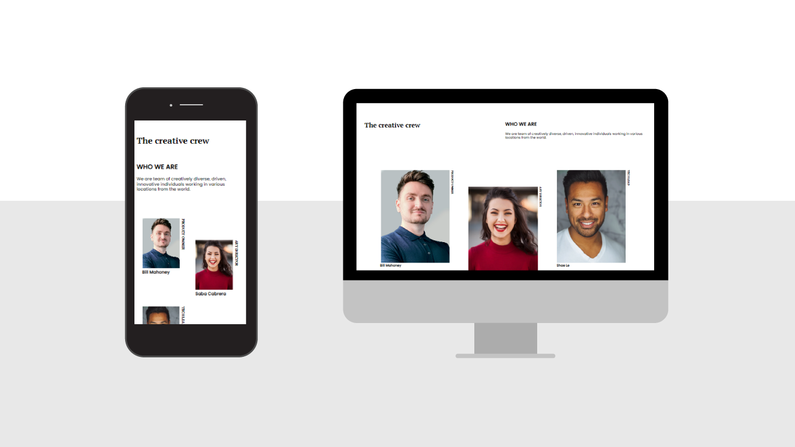

# Make It Real - Stats preview card component

This is a solution to the My Team Page project of the Make It Real course.

## Table of contents

- [Overview](#overview)
  - [The challenge](#the-challenge)
  - [Screenshot](#screenshot)
- [My process](#my-process)
  - [Built with](#built-with)
  - [What I learned](#what-i-learned)
  - [Continued development](#continued-development)
  - [Useful resources](#useful-resources)
- [Author](#author)
- [Acknowledgments](#acknowledgments)

## Overview

### The challenge

Users should be able to:

- Build a team website based on a plain image design
- Adapt css styling to be responsive

### Screenshot



## My process

To begin with, we analized the image proposed as design to identify the structural elements for HTML file. Then we applied that structure to the HTML file. Later, we applied styling with css for the mobile design. Finally we applied the required modifications for the desktop design.

### Built with

- Semantic HTML5 markup
- CSS custom properties
- Flexbox
- Mobile-first workflow

### What I learned

I lernt a couple of handy css properties:

```css
h3.possition {
  writing-mode: vertical-lr;
}

img {
  width: 100%;
  aspect-ratio: 3/4;
  object-fit: cover;
}
```

I also remembered and practiced some other properties:

```css
h2 {
  text-transform: uppercase;
}

.top {
  flex-direction: row-reverse;
}
```

### Continued development

I need to keep working on flex properties. Also I have to study ':nth child' pseudo-selector, as it could help me resolve some design challenges for this design, but could not come around it.

### Useful resources

- [Responsive images guide](https://web.dev/learn/design/responsive-images/) - This helped me to set images correctly.
- [MDN on Writing Mode](https://developer.mozilla.org/en-US/docs/Web/CSS/writing-mode) - This helped me to set the text vertically.

## Author

- [LinkedIn](https://www.linkedin.com/in/juan-orjuela/)
- [Behance](https://www.behance.net/juan_o)

## Acknowledgments

Special aknowledgments to Juan Lorza and Camilo Pimentel, coding partners on this task, and to Germán Escobar, teacher and mentor for supervising our process.
